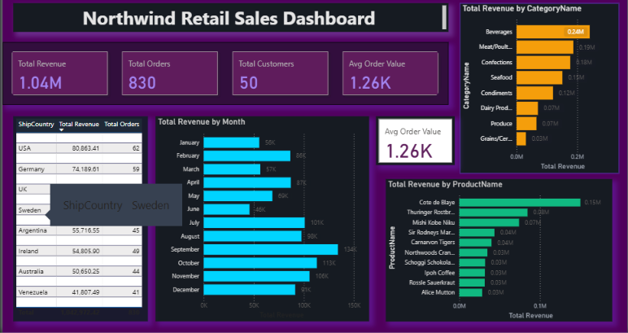

# Northwind Retail Sales Dashboard — Power BI

An interactive retail sales dashboard built in Power BI Desktop using the classic Northwind dataset. Designed to demonstrate end-to-end BI development: data modelling, DAX measures, and professional dark-themed visualisation.



## Tools & Technologies
- Power BI Desktop
- DAX (Data Analysis Expressions)
- Northwind dataset (CSV)
- Star schema data modelling

## Data Model
Five tables connected in a star schema:
- **Order Details** (fact table) → linked to Orders, Products
- **Orders** → linked to Customers
- **Products** → linked to Categories

## DAX Measures
```dax
Total Revenue = SUMX('Order Details', 'Order Details'[UnitPrice] * 'Order Details'[Quantity] * (1 - 'Order Details'[Discount]))
Total Orders = DISTINCTCOUNT(Orders[OrderID])
Total Customers = DISTINCTCOUNT(Orders[CustomerID])
Avg Order Value = DIVIDE([Total Revenue], [Total Orders])
```

## Dashboard Features
- **KPI Cards** — Total Revenue (€1.04M), Orders (830), Customers (50), Avg Order Value (€1.26K)
- **Revenue by Month** — identifies seasonal trends (Oct–Dec peak)
- **Revenue by Category** — Beverages leads at €0.26M
- **Top 10 Products** — Côte de Blaye highest revenue product
- **Country Sales Table** — 21 countries, USA top market at €80.8K

## Key Insights
- October to December is the strongest sales period
- Beverages and Meat/Poultry account for over 40% of total revenue
- USA and Germany are the top two markets by revenue
- Côte de Blaye (wine) is the single highest-revenue product

## How to Open
1. Download `northwind_retail_dashboard.pbix`
2. Open in Power BI Desktop (free download from Microsoft)
3. All data is embedded — no external connections needed

## Author
**Alan Sha** | MSc Data Analytics, Dublin Business School
GitHub: [github.com/alansha1](https://github.com/alansha1)
